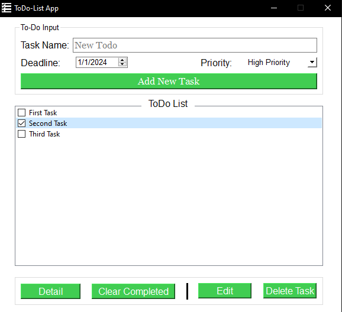

# ToDo-List App

## Overview

The ToDo-List App is a simple GUI application built with Python using the PyQt6 framework. It allows users to manage their tasks by providing features to add, edit, delete, and view details of tasks. The application uses SQLite as the database to store task information.

## Features

- **Add New Task:** Users can create a new task by providing a task name, deadline, and priority.

- **Edit Task:** The application allows users to edit the details of existing tasks, such as the task name, deadline, and priority.

- **Delete Task:** Users can delete individual tasks or clear all completed tasks from the ToDo list.

- **View Task Details:** Users can view detailed information about a selected task, including task name, deadline, priority, and completion status.

## Prerequisites

Make sure you have Python installed on your machine. Additionally, install the required dependencies using the following command:

```bash
pip install PyQt6
```

## Usage

To run the ToDo-List App, execute the following command in the terminal:

```bash
python main.py
```

This will launch the application, and the main window will appear, allowing you to interact with the ToDo list.

## Screenshots




## License

This project is licensed under the [MIT License](LICENSE).

## Acknowledgments

- Thanks to the [PyQt6](https://riverbankcomputing.com/software/pyqt/) team for the powerful GUI framework.
